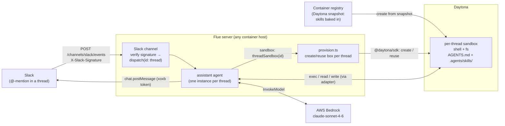

# assistant-slack-daytona — Slack Assistant with per-thread Daytona sandboxes

> One of the [Flue Agent Reference Architectures](../../README.md). See
> [AGENTS.md](../../AGENTS.md) for the shared patterns and
> [docs/adding-skills.md](../../docs/adding-skills.md) for adding your own skills.

A [Flue](https://flueframework.com) project. A Slack [Events API](https://api.slack.com/apis/events-api)
delivery hits the Slack channel, which verifies the request signature and
dispatches to an agent keyed by the Slack thread. Each thread's agent gets its
own remote [Daytona](https://www.daytona.io) sandbox — a fresh Linux box with a
shell and filesystem — so it can actually *run* the task (execute code,
reproduce an error, format input) before replying in the thread.

The agent's **workspace** is a remote Daytona sandbox rather than the server's
local filesystem — so each channel/thread gets an isolated Linux box where the
model can run commands and operate on files. That choice moves where the agent's
work *and its skills* physically live (into the sandbox), which is the main thing
this example demonstrates.

## Two axes: where the server runs vs. where the agent works

These are independent, and the Daytona swap only touches the second:

- **The server** (this Flue process) holds the public HTTPS endpoint Slack POSTs
  to. It must run somewhere with a stable URL — any container host works (a VM,
  Fly.io, Cloud Run, a container service). It does *not* need Kubernetes; this
  example ships a plain `Dockerfile` you can run anywhere.
- **The agent's sandbox** is where the model runs commands and edits files. Here
  that's a Daytona box, created per Slack thread by the app.

Swapping the sandbox to Daytona does **not** remove the need to host the webhook
server — Slack still needs an ingress.

## Structure

```
.agents/
└── skills/                  # discovered by Flue at runtime — FROM THE SANDBOX (see below)
    └── slack-assistant/
        ├── SKILL.md          # do-the-work-then-reply procedure
        └── references/reply-checklist.md
AGENTS.md                    # the agent's always-on framing
src/
├── agents/
│   └── assistant.ts          # pure wiring: model, per-thread Daytona sandbox, reply tool
├── channels/
│   └── slack.ts              # inbound events: verify signature → dispatch by thread;
│                            # also exports the WebClient + reply_in_slack_thread tool
└── sandboxes/
    ├── daytona.ts            # adapter: Daytona SDK ⇒ Flue SandboxApi (fs + exec)
    └── provision.ts          # lifecycle: one Daytona box per thread (create/reuse/auto-clean)
Dockerfile                   # the webhook SERVER image (no skills baked in)
Dockerfile.sandbox           # the DAYTONA SNAPSHOT image (skills baked in)
```

### The big difference from the k8s example: skills live in the sandbox

Flue discovers `AGENTS.md` + `.agents/skills/` at `init()` **from the agent's
sandbox filesystem** — not from the server process's working directory. With a
`local()` sandbox (the k8s example) that's the host, so the server image bakes
the skills. With a **remote** Daytona sandbox, "the filesystem" is the Daytona
box, so the skills must exist *there*:

- `Dockerfile.sandbox` bakes `AGENTS.md` + `.agents/` into an image at
  `/home/daytona` (Daytona's default work dir, which Flue reads via
  `getWorkDir()`).
- You register that image as a Daytona **snapshot** and set `DAYTONA_SNAPSHOT`.
- `provision.ts` creates each thread's box from that snapshot, so a fresh box is
  already skill-ready with no upload at dispatch time.

> If `DAYTONA_SNAPSHOT` is unset, boxes use Daytona's default image and the agent
> runs with **no** framing/skill (it falls back to bare prompting). That's fine
> for a quick sandbox smoke test, but set the snapshot for real use.

### Sandbox lifecycle (the app owns it — Flue has no teardown hook)

`SandboxFactory.createSessionEnv({ id })` is called per agent instance, keyed by
the dispatch `id` (here, the Slack thread key). Flue never calls back when a
conversation ends, so `provision.ts` owns the full lifecycle:

- **Create** one box per thread on first mention, labelled with the thread key.
- **Reuse** it on later mentions (look up by label); restart it if Daytona
  auto-stopped it.
- **Clean up** via Daytona's own timers — `autoStopInterval` (default 15 min
  here) stops an idle box, `autoDeleteInterval` (60 min) deletes it after it
  stops. A quiet thread reaps itself; a thread that wakes before deletion
  restarts the same box.

There is no Flue workflow: this is fire-and-forget; the output is the Slack reply
the agent posts itself.

## Flow



1. Someone `@`-mentions the bot in a thread. Slack POSTs a signed `app_mention`
   to `POST /channels/slack/events`.
2. The channel verifies the signature against `SLACK_SIGNING_SECRET`, then
   dispatches keyed by thread (`teamId`+`channelId`+`threadTs`).
3. The agent's sandbox factory creates (or reuses) that thread's Daytona box from
   the skills snapshot. Flue discovers the framing + skill inside it.
4. The agent does the work in the box (shell + files), then posts the result with
   `reply_in_slack_thread` — bound to that thread, so the model never handles
   channel ids or timestamps.

## Setup

```bash
npm install
cp .env.example .env   # fill in real secrets (Bedrock uses AWS_PROFILE — no key)
```

You need:

- A **Slack app** with Event Subscriptions on (Request URL
  `https://<host>/channels/slack/events`, subscribed to the `app_mention` bot
  event), a bot token (`xoxb-…`, scopes `app_mentions:read` + `chat:write`) →
  `SLACK_BOT_TOKEN`, and the signing secret → `SLACK_SIGNING_SECRET`.
- A **Daytona** account + API key → `DAYTONA_API_KEY`.
- A **skills snapshot** registered with Daytona → `DAYTONA_SNAPSHOT` (build
  `Dockerfile.sandbox`, push to a registry Daytona can pull, register as a
  snapshot).

## Build the skills snapshot

```bash
docker build -f Dockerfile.sandbox -t <REGISTRY>/slack-assistant-skills:v1 .
docker push <REGISTRY>/slack-assistant-skills:v1
# Register it as a Daytona snapshot (CLI or dashboard), then set
# DAYTONA_SNAPSHOT=slack-assistant-skills:v1 in your env.
```

Rebuild + re-register with a fresh tag whenever the skill changes. (Unlike the
k8s example's boot-time `skills add`, the skills here are inside the snapshot, so
new skills ship by rebuilding the snapshot — not by restarting the server.)

## Run locally

```bash
# One-shot, no Slack, no sandbox provisioning needed for a pure-text answer
# (use the local CLI — `npx flue` resolves to an unrelated public package):
./node_modules/.bin/flue run assistant \
  --input '{"message":"What is 2+2?"}'
# NOTE: this still constructs a per-thread Daytona box (DAYTONA_API_KEY required).
# To exercise the sandbox, ask something checkable: "what does `seq 1 5 | paste -sd+ | bc` print?"

# Dev server (defaults to port 3583). Expose it to Slack via a tunnel
# (e.g. `cloudflared tunnel --url http://localhost:3583`) and set the Request URL
# to <tunnel>/channels/slack/events.
./node_modules/.bin/flue dev --target node
```

## Deploy the server

The server is a plain container — run it on whatever gives you a stable HTTPS
URL. No Kubernetes required.

```bash
docker build -t <REGISTRY>/flue-slack-assistant:v1 .
docker push <REGISTRY>/flue-slack-assistant:v1
# Run it on your host of choice (VM / Fly.io / Cloud Run / container service),
# providing the env vars from .env.example as the platform's secrets:
#   SLACK_SIGNING_SECRET, SLACK_BOT_TOKEN, DAYTONA_API_KEY, DAYTONA_SNAPSHOT,
#   AWS_REGION + AWS creds (or an attached IAM role) for Bedrock.
# Expose port 8080 behind TLS, then point Slack's Request URL at it.
```

- **Bedrock auth:** on a host with an instance role, the AWS SDK picks it up; on
  a plain host, set `AWS_ACCESS_KEY_ID`/`AWS_SECRET_ACCESS_KEY` + `AWS_REGION`,
  scoped to `bedrock:InvokeModel` on the `us.` inference profile. (Model is
  configurable; see the repo-root AGENTS.md "Model & provider".)
- **The signature check is the security boundary.** Slack delivers from rotating
  egress IPs, so don't rely on a source-IP allowlist — every request is
  HMAC-verified against `SLACK_SIGNING_SECRET` before any work.
- **Daytona costs scale with live threads.** Each active thread is a running box
  until `autoStopInterval`/`autoDeleteInterval` reap it; tune those in
  `src/sandboxes/provision.ts`.

## Testing

The honest split — only the top layer needs a real Slack workspace:

### Layer 1 — channel logic, no Slack, no Daytona (synthetic signed requests)

Reproduce exactly what Slack sends by signing a payload yourself with your
`SLACK_SIGNING_SECRET`; the signature math is public:

```
basestring = "v0:" + timestamp + ":" + rawBody
X-Slack-Signature = "v0=" + HMAC_SHA256(signingSecret, basestring)   // hex
X-Slack-Request-Timestamp = timestamp
```

Against `flue dev`, assert: URL verification (`type:url_verification` echoes the
`challenge`), a valid `app_mention` → `200` + dispatch, a bad signature →
rejected, a stale timestamp → rejected, and non-`event_callback` types → empty
`200` with no dispatch. None of this touches Slack, Daytona, or Bedrock.

### Layer 2 — agent + sandbox, no Slack (the Daytona round-trip)

```bash
./node_modules/.bin/flue run assistant \
  --input '{"message":"create /tmp/x.txt with the text hi, then cat it"}'
```

With `DAYTONA_API_KEY` (and ideally `DAYTONA_SNAPSHOT`) set, this provisions a
real box and exercises the adapter end-to-end: `exec`, file read/write, and the
per-thread create/reuse logic. Check the Daytona dashboard — you should see a box
labelled with the run id appear, then auto-stop.

### Layer 3 — full E2E on real Slack

Server deployed (or tunnelled), Request URL set, bot invited to a channel.
`@`-mention it with a checkable task and confirm the threaded reply reflects real
sandbox output. The run is async — the Slack reply is the ground truth.

### What you need for real Slack (Layers 3)

| Need | Detail |
|---|---|
| Slack workspace | One where you can install apps |
| Slack app | `app_mention` event subscribed; bot token + signing secret |
| Public URL | Tunnel (local) or your deployed server's hostname |
| Bot in a channel | `/invite @yourbot` so it can see mentions |
| Daytona | `DAYTONA_API_KEY` + a registered `DAYTONA_SNAPSHOT` |
| Bedrock | AWS creds/role + `AWS_REGION` on the `us.` profile |

## Docs

```bash
./node_modules/.bin/flue docs                 # browse
./node_modules/.bin/flue docs search <query>
```
