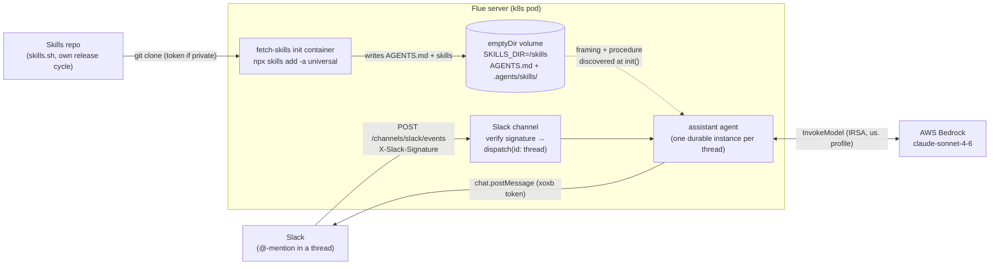

# assistant-slack — Slack Assistant Agent

> One of the [Flue Agent Reference Architectures](../../README.md). See
> [AGENTS.md](../../AGENTS.md) for the shared patterns and
> [docs/adding-skills.md](../../docs/adding-skills.md) for adding your own skills.

A [Flue](https://flueframework.com) project. A Slack [Events API](https://api.slack.com/apis/events-api)
delivery hits the Slack channel, which verifies the request signature and
dispatches to an agent keyed by the Slack thread. The agent answers the question
in the `@`-mention and posts its reply back into the same thread.

Built on Flue's official [`@flue/slack`](https://flueframework.com/docs/ecosystem/channels/slack/)
channel and Slack's official [`@slack/web-api`](https://slack.dev/node-slack-sdk/web-api)
SDK — no hand-rolled signature verification or HTTP.

## Structure

```
.agents/
└── skills/                  # skills, discovered natively by Flue at runtime
    └── slack-assistant/
        ├── SKILL.md          # the answer-in-thread procedure
        └── references/reply-checklist.md
AGENTS.md                    # the agent's always-on framing (discovered from cwd)
src/
├── agents/
│   └── assistant.ts          # the agent — pure wiring: model, sandbox, tools
└── channels/
    └── slack.ts              # inbound events: verify signature → dispatch by thread;
                              # also exports the WebClient + reply_in_slack_thread tool
                              # (outbound). Inbound=channel, outbound=tool, same file
                              # because @flue/slack pairs them.
k8s/
├── base/                     # generic, committed
│   ├── deployment.yaml       # Namespace + ServiceAccount + Deployment + NLB Service
│   ├── secret.example.yaml   # secret template (fill real values out-of-band)
│   └── kustomization.yaml
└── local/
    ├── kustomization.example.yaml  # overlay template (committed)
    └── kustomization.yaml          # your real account values (gitignored)
```

### Where the text lives

There is no instruction prose in `src/`. The agent file is pure wiring; all
text is discovered by Flue from the workspace at `init()`:

- **`AGENTS.md`** — the agent's always-on framing. Flue reads it from the
  sandbox cwd automatically; no import, no `instructions` field.
- **`.agents/skills/slack-assistant/SKILL.md`** — the procedure: read the
  mention, form an answer, reply in the thread.

### Why the channel and the reply tool share a file

`@flue/slack` pairs inbound and outbound around one signing secret + one
`WebClient`. `src/channels/slack.ts` exports three things from that pair:

- `channel` — the inbound half (verifies the Slack signature, dispatches on
  `app_mention`). This is the channel.
- `client` / `replyInThread(...)` — the outbound half: a `chat.postMessage` tool
  bound to a specific thread. This is a tool.

The agent imports `replyInThread` and `channel` from here; the channel imports
the agent. That cycle is fine — both sides read the imported bindings inside
deferred callbacks (the channel's `events`, the agent's factory), never at
module top level.

### Skills are discovered natively, not bundled

Skills are **not** imported with `with { type: 'skill' }`. Flue discovers them at
`init()` from `<cwd>/.agents/skills/<name>/SKILL.md` inside the agent's sandbox,
and rereads `SKILL.md` on activation — so edits land without a rebuild. The
agent just needs a filesystem sandbox pointed at the right cwd:

```ts
const cwd = process.env.SKILLS_DIR ?? process.cwd();
const sandbox = local({ cwd });
```

- **Detached & separate release cycle.** Skills are a directory, not code. In
  production, fetch the Skills Project (e.g. an init container that runs
  `skills add`) and set `SKILLS_DIR` to point there — no rebuild. See
  [Skills in production](#skills-in-production) below.
- **Runtime-resolved.** `cwd` is read from `process.env` at boot, so the same
  build reads different skills per environment.
- **Dynamic.** Bodies are reread per activation, so a changed `SKILL.md` takes
  effect on the next mention without re-initialising.

There is no workflow: this is a fire-and-forget job whose output is the Slack
reply the agent posts itself, so a bounded workflow with a structured return
value would be unused indirection. Add a workflow only if something downstream
needs to consume the reply *result*.

## Flow



1. Someone `@`-mentions the bot in a Slack thread. Slack POSTs an
   `event_callback` (an `app_mention` event) to
   `POST /channels/slack/events`, signed with `X-Slack-Signature`.
2. The Slack channel verifies the signature against `SLACK_SIGNING_SECRET`
   (Slack's URL-verification challenge is acknowledged internally), then
   dispatches to the agent keyed by the thread (`teamId` + `channelId` +
   `threadTs`) so each thread is its own durable agent instance.
3. The agent reads the mention text, forms an answer, and posts it back into the
   thread with the `reply_in_slack_thread` tool — which is bound to that thread,
   so the model never handles channel ids or timestamps.

## Setup

```bash
npm install
cp .env.example .env   # fill in real secrets (Bedrock uses AWS_PROFILE — no key)
```

You need a Slack app with:

- **Event Subscriptions** on, Request URL pointing at
  `https://<host>/channels/slack/events`, subscribed to the `app_mention` bot
  event.
- A **bot token** (`xoxb-…`, scope `app_mentions:read` + `chat:write`) →
  `SLACK_BOT_TOKEN`.
- The app's **Signing Secret** → `SLACK_SIGNING_SECRET`.

## Run locally

```bash
# One-shot, no server (use the local CLI — `npx flue` resolves to an unrelated
# public package named "flue"). Skip Slack entirely and just talk to the agent:
./node_modules/.bin/flue run assistant \
  --input '{"message":"What is our on-call rotation?"}'

# Dev server (defaults to port 3583). Point Slack at it through a tunnel
# (e.g. `cloudflared tunnel --url http://localhost:3583`) and set the Request URL
# to <tunnel>/channels/slack/events. Slack signs every delivery, so you cannot
# usefully curl the events route without a valid X-Slack-Signature.
SLACK_SIGNING_SECRET=… SLACK_BOT_TOKEN=… ./node_modules/.bin/flue dev --target node
```

## Deploy to Kubernetes

The app runs in its own `flue-slack-assistant` namespace as a single
long-running Flue server. `k8s/base/` defines the Namespace, ServiceAccount
(IRSA), Deployment, and an internet-facing NLB Service; a gitignored
`k8s/local/` overlay patches in your account values (see below).

```bash
# 1. Build for the cluster's CPU arch (EKS nodes are amd64; an arm64 image
#    built on Apple Silicon fails with "exec format error"). Use a FRESH
#    immutable tag each time — reusing a tag leaves nodes serving the cached
#    old image.
aws ecr get-login-password --region "$AWS_REGION" | docker login --username AWS \
  --password-stdin "$REGISTRY"
docker build --platform linux/amd64 -t "$REGISTRY/flue-slack-assistant:v1" .
docker push "$REGISTRY/flue-slack-assistant:v1"
# Set REGISTRY to your own ECR (or other) registry; set the matching image
# name/tag in your k8s/local/ overlay (step 3).

# 2. Secret (SLACK_SIGNING_SECRET must match the Slack app; SLACK_BOT_TOKEN is
#    the xoxb- bot token; SKILLS_GIT_TOKEN only if the skills repo is private).
kubectl -n flue-slack-assistant create secret generic flue-slack-assistant-secrets \
  --from-literal=SLACK_SIGNING_SECRET=... \
  --from-literal=SLACK_BOT_TOKEN=xoxb-...
# AWS Bedrock auth comes from the pod's IAM role (IRSA), not a secret.

# 3. Deploy via your LOCAL overlay (your account values stay out of git).
cp k8s/local/kustomization.example.yaml k8s/local/kustomization.yaml
# edit k8s/local/kustomization.yaml — registry, IAM role ARN, skills repo
kubectl apply -k k8s/local/
kubectl -n flue-slack-assistant rollout status deploy/flue-slack-assistant
```

### Account values stay local (Kustomize)

The committed manifest (`k8s/base/`) is generic — it has placeholders, not your
account. Your real values live in `k8s/local/kustomization.yaml`, which is
**gitignored**. You never hand-edit a committed file:

- `k8s/base/` — generic Deployment + Service + ServiceAccount (committed).
- `k8s/local/kustomization.example.yaml` — the overlay **template** (committed):
  registry image, IRSA role ARN, skills repo.
- `k8s/local/kustomization.yaml` — your copy with real values (**gitignored**).

`kubectl apply -k k8s/local/` builds base + overlay. Secrets are separate — they
go in the `flue-slack-assistant-secrets` Secret created above, never in the overlay.

### Deployment notes (lessons that generalize)

- **Image:** build `--platform linux/amd64` (EKS nodes are amd64; an Apple
  Silicon build fails with `exec format error`). Deploy under a **fresh
  immutable tag** each time — reusing a tag leaves nodes serving the cached image.
- **Model:** `amazon-bedrock/us.anthropic.claude-sonnet-4-6`. Make sure the
  model specifier matches what your IAM policy allows — a policy scoped to the
  `us.` inference profile denies the `global.` one. (Model is configurable; see
  the repo-root AGENTS.md "Model & provider".)
- **Bedrock IRSA:** annotate the `flue-slack-assistant` ServiceAccount with an
  IAM role that grants `bedrock:InvokeModel*`. If you reuse a role across service
  accounts, extend its trust policy **additively** (list both
  `system:serviceaccount:<ns>:<sa>` subjects) so you don't break the existing one.
- **NLB:** internet-facing. Unlike a fixed-source webhook (e.g. Jira from a known
  range), Slack delivers from rotating egress IPs, so this is *not* locked to a
  prefix-list — the channel's `X-Slack-Signature` verification is the security
  boundary (every request is HMAC-checked against `SLACK_SIGNING_SECRET` before
  any work). Lock it down further only if you front it with something that gives
  you a stable source range.
- **Readiness probe is TCP, not HTTP** — Flue serves no `GET /` route (it 404s),
  so an httpGet probe would never pass and the Service would have no endpoints.

### Point Slack at it

In your Slack app config → **Event Subscriptions**:

- **Request URL:** `https://<nlb-hostname>/channels/slack/events`
- Slack immediately POSTs a `url_verification` challenge; the channel verifies
  the signature and answers it internally — the URL goes green once the NLB has
  endpoints and DNS resolves.
- **Subscribe to bot events:** `app_mention`.
- Reinstall the app if you changed scopes, then `@`-mention the bot in a channel
  it's in. The reply lands in the thread (the run is async; the pod log stays
  quiet — the Slack reply is the ground truth).

### Skills in production

Skills are **fetched at boot from their own repo**, not baked into the agent
image — so they're on a separate release cycle. The base `deployment.yaml` wires
this with an init container:

- A `fetch-skills` init container (a `node:22` image) runs
  `npx skills add <repo> -a universal` ([skills.sh](https://skills.sh)) into a
  shared `emptyDir` volume. `-a universal` installs straight to `.agents/skills/`.
- The app container mounts that volume and sets `SKILLS_DIR=/skills`. Flue
  discovers `/skills/.agents/skills/` at `init()`.

Point it at your repo via the overlay (set `SKILLS_REPO` to `org/path`; see
`k8s/local/`); the init container re-runs on every pod start, so a **rolling
restart picks up new skills with no app rebuild**. If the skills repo is
**private**, the init container authenticates git with `SKILLS_GIT_TOKEN` from
the Secret via a one-line `git config … insteadOf` (skills.sh strips credentials
from the URL, so the token is given to git below the CLI); it's optional, so a
public repo needs no token. A plain `git clone` alternative is documented in
[docs/adding-skills.md](../../docs/adding-skills.md).

> **Why not a ConfigMap?** A ConfigMap caps at ~1 MB and flattens directory
> structure, so it can't carry a skill's `references/` subtree. `emptyDir` +
> init container has no size limit and preserves the full tree. The image still
> bakes `.agents/skills/` (via the Dockerfile) as a fallback for local
> `flue run`, but in k8s `SKILLS_DIR` overrides it.

## Docs

```bash
./node_modules/.bin/flue docs                 # browse
./node_modules/.bin/flue docs search <query>
```
