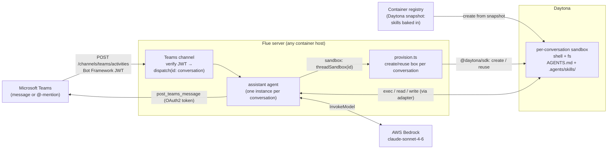

# assistant-teams-daytona — Teams Assistant with per-conversation Daytona sandboxes

> One of the [Flue Agent Reference Architectures](../../README.md). See
> [AGENTS.md](../../AGENTS.md) for the shared patterns and
> [docs/adding-skills.md](../../docs/adding-skills.md) for adding your own skills.

A [Flue](https://flueframework.com) project. A Teams Bot Connector activity
delivery hits the Teams channel, which verifies the Bot Framework JWT and
dispatches to an agent keyed by the Teams conversation. Each conversation's agent
gets its own remote [Daytona](https://www.daytona.io) sandbox — a fresh Linux box
with a shell and filesystem — so it can actually *run* the task (execute code,
reproduce an error, format input) before replying in the conversation.

The enterprise-chat counterpart to `assistant-slack-daytona`, with Teams-specific
Bot Framework JWT auth (inbound) and OAuth 2.0 client-credentials (outbound).

## Structure

```
.agents/
└── skills/                  # discovered by Flue at runtime — FROM THE SANDBOX (see below)
    └── teams-assistant/
        ├── SKILL.md          # do-the-work-then-reply procedure
        └── references/reply-checklist.md
AGENTS.md                    # the agent's always-on framing
src/
├── agents/
│   └── assistant.ts          # pure wiring: model, per-conversation Daytona sandbox, reply tool
├── channels/
│   └── teams.ts              # inbound activities: verify JWT → dispatch by conversation;
│                             # also exports the post_teams_message tool
├── lib/
│   ├── helpers.ts            # stripAtMention — pure logic (tested)
│   ├── helpers.test.ts       # node:test coverage for helpers
│   └── teams-client.ts       # Fetch-based outbound Bot Connector client
└── sandboxes/
    ├── daytona.ts            # adapter: Daytona SDK ⇒ Flue SandboxApi (fs + exec)
    └── provision.ts          # lifecycle: one Daytona box per conversation (create/reuse/auto-clean)
Dockerfile                   # the webhook SERVER image (no skills baked in)
Dockerfile.sandbox           # the DAYTONA SNAPSHOT image (skills baked in)
```

### The key idea: skills live in the sandbox

Flue discovers `AGENTS.md` + `.agents/skills/` at `init()` **from the agent's
sandbox filesystem** — not from the server process's working directory. With a
remote Daytona sandbox, the skills must exist *there*:

- `Dockerfile.sandbox` bakes `AGENTS.md` + `.agents/` into an image at
  `/home/daytona` (Daytona's default work dir).
- You register that image as a Daytona **snapshot** and set `DAYTONA_SNAPSHOT`.
- `provision.ts` creates each conversation's box from that snapshot, so a fresh
  box is already skill-ready with no upload at dispatch time.

## Flow



1. Someone messages (or @-mentions) the bot. Teams POSTs a signed Bot Connector
   activity to `POST /channels/teams/activities`.
2. The channel verifies the Bot Framework JWT, then dispatches keyed by
   conversation (`conversationId` + `serviceUrl` + `tenantId` etc.).
3. The agent's sandbox factory creates (or reuses) that conversation's Daytona
   box from the skills snapshot. Flue discovers the framing + skill inside it.
4. The agent does the work in the box (shell + files), then posts the result with
   `post_teams_message` — bound to that conversation, so the model never handles
   serviceUrls or conversation ids.

## How to test this — read this first

There is **no local emulator shortcut** for this example, and it's worth
understanding why before you sink time into one. The Teams channel
(`@flue/teams`) rejects anything that isn't genuine, Microsoft-signed Teams
traffic, in this order (see `context/flue/packages/teams/src/routes.ts`):

1. It **requires a Bot Framework JWT** (`Authorization: Bearer …`) signed by
   Microsoft's keys, with your App ID as the audience. No token → `401`.
2. It requires `channelId: "msteams"` → anything else (e.g. the Bot Framework
   Emulator sends `"emulator"`) → `403`.
3. It requires the token to carry the `msteams` endorsement → `401` otherwise.

So the **Bot Framework Emulator, `curl`, and Postman cannot reach the agent** —
they're rejected at ingress by design (this is the enterprise-auth posture the
example exists to demonstrate). Testing therefore comes in two honest tiers:

| Tier | What it proves | What you need |
|---|---|---|
| **1 — offline checks** | code compiles, agent registers, ingress rejects non-Teams traffic, pure logic is correct | nothing (no accounts) |
| **2 — real Teams end-to-end** | the whole loop: Teams → JWT verify → sandbox → reply | Azure Bot + M365/Teams tenant + Daytona + Bedrock |

### Tier 1 — offline checks (no accounts)

```bash
npm install
npm test                              # node:test — pure helpers (stripAtMention), no network
./node_modules/.bin/tsc --noEmit      # typecheck
./node_modules/.bin/flue build --target node   # agent + channel register

# Boot the server and confirm the ingress is wired and correctly locked down.
# (Dummy Teams values are fine — they only need to be present for config to load.)
TEAMS_APP_ID=00000000-0000-0000-0000-000000000000 \
TEAMS_TENANT_ID=00000000-0000-0000-0000-000000000000 \
TEAMS_APP_PASSWORD=dummy DAYTONA_API_KEY=dummy DAYTONA_SNAPSHOT=none \
AWS_REGION=us-west-2 \
./node_modules/.bin/flue dev --target node      # → http://localhost:3583, channel: teams

# In another shell — an unauthenticated POST MUST be rejected (this is the pass):
curl -s -o /dev/null -w '%{http_code}\n' -X POST \
  http://localhost:3583/channels/teams/activities \
  -H 'Content-Type: application/json' -d '{"type":"message","text":"hi"}'
# Expect: 401  ← proves JWT verification is active. A 200 here would be a bug.
```

This is the ceiling of what you can verify without Microsoft's infrastructure. To
actually see the bot *reply*, you need Tier 2.

### Tier 2 — real Teams, end to end

Roughly an hour, and you need: an **Azure** subscription, an **M365 tenant with
Teams** where you can sideload a custom app (or an admin who can), a **Daytona**
account, and **AWS Bedrock** access. Steps:

1. **Register the bot in Azure.** Azure Portal → create an **Azure Bot** resource
   (or an App Registration + Bot Channels Registration). This yields:
   - **App ID** → `TEAMS_APP_ID`
   - a **client secret** you generate → `TEAMS_APP_PASSWORD`
   - your **Directory (tenant) ID** → `TEAMS_TENANT_ID`
     (`TEAMS_APP_ID`/`TEAMS_TENANT_ID` drive inbound JWT verification;
     `TEAMS_APP_PASSWORD` is used only for the *outbound* OAuth token in
     `teams-client.ts`.)
2. **Enable the Microsoft Teams channel** on the Azure Bot resource.
3. **Build + register the Daytona skills snapshot** (the agent discovers
   `AGENTS.md` + `.agents/skills/` from the sandbox filesystem, so they must be
   baked into the box — see "The key idea" above):
   ```bash
   docker build -f Dockerfile.sandbox -t <REGISTRY>/teams-assistant-skills:v1 .
   docker push <REGISTRY>/teams-assistant-skills:v1
   # Register it as a Daytona snapshot, then set DAYTONA_SNAPSHOT to its name.
   ```
4. **Run the server on a public HTTPS URL** so Teams can reach it. Two options:
   - **Local dev + tunnel:** `flue dev --target node`, then expose `:3583` with a
     [dev tunnel](https://learn.microsoft.com/azure/developer/dev-tunnels/) or
     ngrok — fastest for iterating.
   - **Container:** build and run the server image on any HTTPS host:
     ```bash
     docker build -t <REGISTRY>/flue-teams-assistant:v1 .
     docker push <REGISTRY>/flue-teams-assistant:v1
     ```
   Either way set: `TEAMS_APP_ID`, `TEAMS_APP_PASSWORD`, `TEAMS_TENANT_ID`,
   `DAYTONA_API_KEY`, `DAYTONA_SNAPSHOT`, `AWS_REGION` + AWS creds for Bedrock.
5. **Point the bot's messaging endpoint** at
   `https://<YOUR_HOST>/channels/teams/activities` (Azure Bot → Configuration →
   Messaging endpoint).
6. **Sideload the app into Teams.** Create a minimal Teams app manifest whose
   `bot.botId` is your `TEAMS_APP_ID`, zip it with the icons, and upload via
   Teams → Apps → *Manage your apps* → *Upload a custom app*. (Requires custom-app
   upload to be allowed in the tenant.)
7. **Message the bot** — DM it, or `@`-mention it in a channel. You should see the
   reply posted back in-thread; the server log shows the dispatch and the Daytona
   box being provisioned for that conversation.

> **Debugging a silent bot:** a non-`200` from your endpoint is Teams telling you
> auth failed — `401` almost always means the App ID/secret/tenant don't match
> the registered bot; `403` means the traffic isn't coming through the Teams
> channel. Check the server log first.

## Docs

```bash
./node_modules/.bin/flue docs
./node_modules/.bin/flue docs search <query>
```
