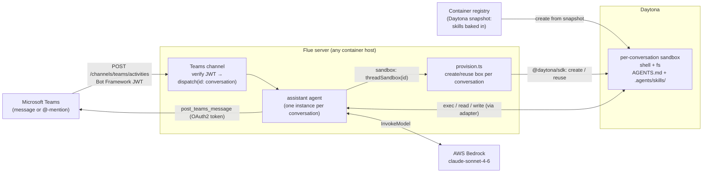

# assistant-teams-daytona — Teams Assistant with per-conversation Daytona sandboxes

> One of the [Flue Agent Reference Architectures](../../README.md). See
> [AGENTS.md](../../AGENTS.md) for the shared patterns and
> [docs/adding-skills.md](../../docs/adding-skills.md) for adding your own skills.

A [Flue](https://flueframework.com) project. A Teams Bot Connector activity
delivery hits the Teams channel, which verifies the Bot Framework JWT and
dispatches to an agent keyed by the Teams conversation. Each conversation's agent
gets its own remote [Daytona](https://www.daytona.io) sandbox — a fresh Linux box
with a shell and filesystem — so it can actually *run* the task (execute code,
reproduce an error, format input) before replying in the conversation.

The enterprise-chat counterpart to `assistant-slack-daytona`, with Teams-specific
Bot Framework JWT auth (inbound) and OAuth 2.0 client-credentials (outbound).

## Structure

```
.agents/
└── skills/                  # discovered by Flue at runtime — FROM THE SANDBOX (see below)
    └── teams-assistant/
        ├── SKILL.md          # do-the-work-then-reply procedure
        └── references/reply-checklist.md
AGENTS.md                    # the agent's always-on framing
src/
├── agents/
│   └── assistant.ts          # pure wiring: model, per-conversation Daytona sandbox, reply tool
├── channels/
│   └── teams.ts              # inbound activities: verify JWT → dispatch by conversation;
│                             # also exports the post_teams_message tool
├── lib/
│   ├── helpers.ts            # stripAtMention — pure logic (tested)
│   ├── helpers.test.ts       # node:test coverage for helpers
│   └── teams-client.ts       # Fetch-based outbound Bot Connector client
└── sandboxes/
    ├── daytona.ts            # adapter: Daytona SDK ⇒ Flue SandboxApi (fs + exec)
    └── provision.ts          # lifecycle: one Daytona box per conversation (create/reuse/auto-clean)
Dockerfile                   # the webhook SERVER image (no skills baked in)
Dockerfile.sandbox           # the DAYTONA SNAPSHOT image (skills baked in)
```

### The key idea: skills live in the sandbox

Flue discovers `AGENTS.md` + `.agents/skills/` at `init()` **from the agent's
sandbox filesystem** — not from the server process's working directory. With a
remote Daytona sandbox, the skills must exist *there*:

- `Dockerfile.sandbox` bakes `AGENTS.md` + `.agents/` into an image at
  `/home/daytona` (Daytona's default work dir).
- You register that image as a Daytona **snapshot** and set `DAYTONA_SNAPSHOT`.
- `provision.ts` creates each conversation's box from that snapshot, so a fresh
  box is already skill-ready with no upload at dispatch time.

## Flow



1. Someone messages (or @-mentions) the bot. Teams POSTs a signed Bot Connector
   activity to `POST /channels/teams/activities`.
2. The channel verifies the Bot Framework JWT, then dispatches keyed by
   conversation (`conversationId` + `serviceUrl` + `tenantId` etc.).
3. The agent's sandbox factory creates (or reuses) that conversation's Daytona
   box from the skills snapshot. Flue discovers the framing + skill inside it.
4. The agent does the work in the box (shell + files), then posts the result with
   `post_teams_message` — bound to that conversation, so the model never handles
   serviceUrls or conversation ids.

## Setup

```bash
npm install
cp .env.example .env   # fill in real secrets
```

You need:

- A **Teams Bot** registered in Azure Portal (Bot Framework registration). Provides
  `TEAMS_APP_ID`, `TEAMS_APP_PASSWORD`, `TEAMS_TENANT_ID`.
- A **Daytona** account + API key → `DAYTONA_API_KEY`.
- A **skills snapshot** registered with Daytona → `DAYTONA_SNAPSHOT` (build
  `Dockerfile.sandbox`, push to a registry Daytona can pull, register as a
  snapshot).

## Build the skills snapshot

```bash
docker build -f Dockerfile.sandbox -t <REGISTRY>/teams-assistant-skills:v1 .
docker push <REGISTRY>/teams-assistant-skills:v1
# Register it as a Daytona snapshot, then set
# DAYTONA_SNAPSHOT=teams-assistant-skills:v1 in your env.
```

## Run locally

```bash
# Dev server (defaults to port 3583). Expose it to Teams via a tunnel.
./node_modules/.bin/flue dev --target node
```

## Deploy the server

```bash
docker build -t <REGISTRY>/flue-teams-assistant:v1 .
docker push <REGISTRY>/flue-teams-assistant:v1
# Run on any container host that exposes a stable HTTPS URL.
# Required env vars: TEAMS_APP_ID, TEAMS_APP_PASSWORD, TEAMS_TENANT_ID,
# DAYTONA_API_KEY, DAYTONA_SNAPSHOT, AWS_REGION + AWS creds for Bedrock.
# Point your Bot's messaging endpoint at https://<HOST>/channels/teams/activities
```

## Testing

```bash
npm test   # node:test — pure helpers (no network)
./node_modules/.bin/tsc --noEmit
./node_modules/.bin/flue build --target node
```

## Docs

```bash
./node_modules/.bin/flue docs
./node_modules/.bin/flue docs search <query>
```
