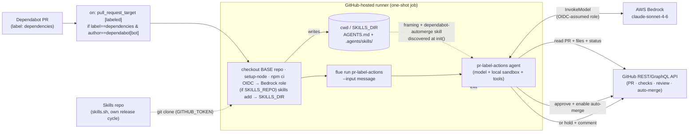

# github-pr-label-actions — label a PR, an agent acts on it (GitHub Actions)

> One of the [Flue Agent Reference Architectures](../../README.md). See
> [AGENTS.md](../../AGENTS.md) for the shared patterns and
> [docs/adding-skills.md](../../docs/adding-skills.md) for adding your own skills.

A **generic** PR-action agent: a label on a pull request triggers a one-shot
`flue run` on a GitHub-hosted runner, and **the skill matching that label decides
what to do**. The agent itself is action-agnostic wiring — you add a behavior by
adding a skill, not by editing code.

The shipped example skill is **`dependabot-automerge`**: when Dependabot opens a
dependency-update PR (label `dependencies`), the agent judges whether it's
low-risk **within a policy the skill defines**, and if so approves it and enables
auto-merge — otherwise it holds the PR for a human and comments why. "Low-risk"
is the model's judgement *bounded by hard limits in the skill* (patch/minor only,
green CI, lockfile-only diff); the limits live in the skill, not the code, so you
tune them without a rebuild.

It is a sibling of [`triage-github-actions`](../triage-github-actions/): same
one-shot Actions pattern, Bedrock model, and OIDC auth — different trigger (a PR
label) and a different job (acting on PRs instead of triaging issues).

## How a label reaches the runner — and why it's safe

```
Dependabot opens a PR  →  it carries the `dependencies` label
  → on: pull_request_target [labeled]   (gated: label == dependencies
                                          AND author == dependabot[bot])
  → GitHub-hosted runner: npm ci → flue run pr-label-actions --input '{...PR…}'
  → agent reads PR metadata, judges risk, approves + enables auto-merge
    (or holds + comments) → exits
  → GitHub merges only after required checks pass
```

The trigger is **`pull_request_target`** on purpose: a plain `pull_request` from
Dependabot or a fork gets a *read-only* token and couldn't approve or merge.
`pull_request_target` runs in the base repo's context with a write token. The
well-known risk of that token is running untrusted PR code — so this agent
**never checks out or runs the PR's code**; it works entirely through the GitHub
API, and the workflow checks out the base repo, not the PR head. The job is also
gated to `dependabot[bot]` as the author, so a contributor can't trigger it by
labelling their own PR.



## The risk policy (lives in the skill, not the code)

`dependabot-automerge` auto-merges only when **every** hard limit holds —
patch/minor bump (never major/unknown), green combined CI, and a manifest/
lockfile-only diff. The model has discretion *within* those limits and is told
"when in doubt, hold". Edit
[`.agents/skills/dependabot-automerge/SKILL.md`](.agents/skills/dependabot-automerge/SKILL.md)
and its [`references/risk-policy.md`](.agents/skills/dependabot-automerge/references/risk-policy.md)
to tighten or loosen it (e.g. patch-only, or minor only for devDependencies) —
no rebuild.

## Shape

```
AGENTS.md                                       # agent framing (action-agnostic)
.agents/skills/dependabot-automerge/            # the shipped label→action skill
├── SKILL.md                                     #   the procedure + risk limits
└── references/risk-policy.md                    #   the decision checklist
.github/workflows/pr-label-actions.yml          # gated pull_request_target trigger
src/
├── agents/pr-label-actions.ts                  # model + local() sandbox + tools — NO channel
└── tools/github/
    ├── github.ts                               # outbound GitHub tools (@octokit/rest)
    ├── helpers.ts                              # pure helpers (repo parse, semver bump)
    └── helpers.test.ts                         # unit tests (node:test, no extra deps)
```

There is no `src/channels/` (the workflow is the trigger) and no `k8s/` (the
runner is the deploy). To add another label-driven behavior (e.g. auto-label
docs PRs), add a new skill keyed to that label — the agent and tools are reused.

## Run it locally (one-shot, exactly as CI does)

```bash
npm install
cp .env.example .env   # Bedrock uses AWS_PROFILE; add a GITHUB_TOKEN (PAT, repo scope)
./node_modules/.bin/flue run pr-label-actions \
  --input '{"message":"Act on GitHub PR your-org/your-repo#42 (dependencies label)."}'
npm test               # unit tests for the pure helpers
```

`flue run` input must be an object with a string `message`; the skill parses the
`owner/repo` and PR number out of it.

## Deploy

1. **Bedrock via OIDC** — no long-lived AWS keys. Create the GitHub OIDC provider
   and a Bedrock-only IAM role whose trust policy allows this repo's OIDC
   subject, then set repo **variables** `AWS_ROLE_ARN` and `AWS_REGION`. Full CLI
   setup: [docs/github-actions-bedrock-oidc.md](../../docs/github-actions-bedrock-oidc.md).
2. **Enable auto-merge** in the repo (Settings → General → Pull Requests → Allow
   auto-merge). The agent enables auto-merge per-PR; GitHub merges once required
   checks pass.
3. **Require your CI checks** on the base branch (branch protection / ruleset),
   so auto-merge actually waits for them. Without a required check, auto-merge
   merges as soon as it's enabled.
4. Commit `.github/workflows/pr-label-actions.yml`. Dependabot applies the
   `dependencies` label by default, which triggers the agent.

> The built-in `GITHUB_TOKEN` is scoped to the workflow's repo, which is all this
> agent needs. Note: to let GitHub Actions *approve* PRs, also enable Settings →
> Actions → General → "Allow GitHub Actions to create and approve pull requests".

## Trigger drives deploy

This pairing — PR label → `pull_request_target` → one-shot runner — is the
CI-driven path, the same shape as `triage-github-actions`. For an always-on
server reacting to PR events in real time, use Flue's official GitHub channel
(`@flue/github`) on a long-running deploy instead. See [AGENTS.md](../../AGENTS.md).
