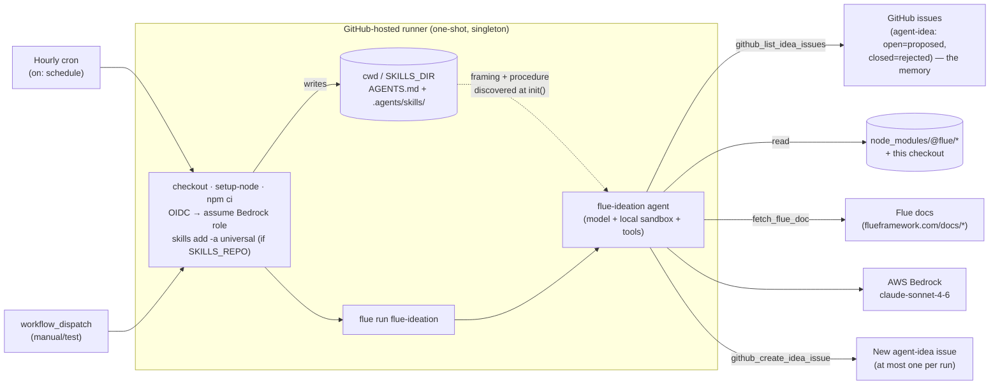

# ideate-scheduled-actions — scheduled backlog ideation on GitHub Actions

> One of the [Flue Agent Reference Architectures](../../README.md). See
> [AGENTS.md](../../AGENTS.md) for the shared patterns and
> [docs/adding-skills.md](../../docs/adding-skills.md) for adding your own skills.

This is the repo's **first scheduled example**. On an hourly cron, the agent runs
**one-shot on a GitHub-hosted runner** (`flue run`), surveys this repo's example
matrix against what Flue actually offers — its installed `@flue/*` packages and
its docs — and, when it finds a genuinely new high-value gap, files **one**
GitHub issue labelled `agent-idea` proposing what to build or fix next. Most
hours it finds nothing new and **files zero issues** — that is the healthy
default, not a failure.

It is the scheduled counterpart to
[`triage-github-actions`](../triage-github-actions/): same one-shot
Actions/`flue run`/OIDC→Bedrock shape, but the **trigger is a clock**, not a
label.

## Why no channel — and why a clock instead of an event

Flue ships official **channels** for the webhook→server path. This example
deliberately takes the **other** path, like the other Actions examples: a
GitHub-hosted runner is a one-shot CI executor with no always-on listener, so
there is no Flue channel here. **GitHub Actions itself is the trigger** — but
where the triage examples are triggered by an issue/PR event, this one is
triggered by `on: schedule` (cron). (Scheduled triggers aren't in Flue's
GitHub-Actions guide yet; the rest of the shape — `flue run`, OIDC→Bedrock,
typed tools — is the documented pattern.)

```
Hourly cron tick (on: schedule)
  → GitHub-hosted runner (singleton via concurrency group)
  → npm ci → flue run flue-ideation
  → agent lists `agent-idea` issues (its memory); if at cap (5 open) → exit cheap
  → else: reads the example matrix (local) + node_modules/@flue/* + Flue docs
  → finds the highest-value gap, dedups vs open AND closed ideas
  → files at most ONE `agent-idea` issue (or none) → exits
```



## What it reads and writes

- **Reads (no token):** this checkout's example matrix (`README.md` table, each
  `examples/*`) and installed Flue (`node_modules/@flue/*`) — plain filesystem
  reads in the sandbox.
- **Reads (typed tool):** a small set of Flue doc pages via `fetch_flue_doc`,
  pinned to `https://flueframework.com/docs/*` (the page list lives in the
  skill).
- **Writes (typed tool):** lists and creates `agent-idea` issues via Octokit
  (`github_list_idea_issues`, `github_create_idea_issue`).

## The idea charter

The agent stays inside a tight charter (full text in the skill):

- **Coverage gap** — Flue ships a capability no example uses.
- **Doc/example mismatch** — docs describe a pattern no example shows, or an
  example contradicts the docs.
- **Drift** — installed `@flue/*` exposes an API/pattern the examples don't use.

Out of charter: freeform product ideas and lint nits.

## Memory, cap, and discipline

- **The issue tracker is the agent's whole memory.** Open `agent-idea` =
  already proposed; **closed `agent-idea` = a human rejected it, never
  re-propose** (see [ADR 0001](../../docs/adr/0001-issue-tracker-as-ideation-memory.md)).
- **Cap: 5 open ideas.** At the cap the agent exits cheaply (one API call, near
  zero model cost) before any survey or doc fetch.
- **One issue per run, max.** Even below the cap, it files only its single best
  idea per hour.

## The hand-off to triage (human-gated)

A human reviews `agent-idea` issues and relabels the good ones `triage`; the
existing [`triage`](../triage-github-actions/) workflow then enriches them. The
ideation agent never applies `triage` itself — the human is the quality gate.
Auto-chaining `agent-idea` → `triage` is an explicit non-goal
([ADR 0002](../../docs/adr/0002-human-gated-idea-to-triage-handoff.md)).

## Setup

1. **Create the `agent-idea` label** (one-time; creating an issue does not
   auto-create labels):
   ```bash
   gh label create agent-idea --description "Filed by the scheduled ideation agent" --color BFD4F2
   ```
2. **Bedrock via OIDC** — set repository variables `AWS_ROLE_ARN` (a Bedrock-only
   role whose trust policy allows this repo's OIDC subject) and `AWS_REGION`. See
   [docs/github-actions-bedrock-oidc.md](../../docs/github-actions-bedrock-oidc.md).
3. **Enable the workflow** — it runs hourly once on the default branch. Trigger a
   test run from the Actions tab (`workflow_dispatch`).
4. *(Optional)* set `SKILLS_REPO` to load the skill from its own repo on a
   separate release cycle.

## Run it locally

```bash
cp .env.example .env   # set AWS_PROFILE, AWS_REGION, GITHUB_TOKEN, GITHUB_REPOSITORY
npm ci
npm test               # unit tests for the pure helpers
./node_modules/.bin/flue run flue-ideation \
  --input '{"message":"Run scheduled ideation over this repo."}'
```

Cadence is the cost/noise dial: edit the `cron:` in
[.github/workflows/ideate.yml](.github/workflows/ideate.yml) (`0 */4 * * *` for
every four hours, etc.). GitHub disables scheduled workflows after 60 days of
repo inactivity.

## Layout

```
ideate-scheduled-actions/
├── AGENTS.md                                  # always-on framing
├── src/
│   ├── agents/flue-ideation.ts                # pure wiring: model + sandbox + tools
│   └── tools/
│       ├── github/{github.ts,helpers.ts}      # list/create agent-idea issues
│       └── flue/{docs.ts,helpers.ts}          # pinned doc fetcher
├── .agents/skills/flue-ideation/
│   ├── SKILL.md                               # the procedure + charter
│   └── references/issue-template.md           # the idea issue body shape
└── .github/workflows/ideate.yml               # hourly cron → flue run
```
