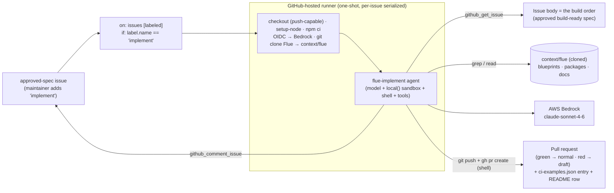

# implement-github-actions — build a Flue example from an approved spec, on GitHub Actions

> One of the [Flue Agent Reference Architectures](../../README.md). See
> [AGENTS.md](../../AGENTS.md) for the shared patterns and
> [docs/adding-skills.md](../../docs/adding-skills.md) for adding your own skills.

The **final stage** of an ideate → spec → implement pipeline. A maintainer
applies the **`implement`** label to an `approved-spec` issue (a promoted, agreed
spec); the agent reads that spec, **scaffolds the new `examples/<name>/`, runs
the build/test loop until green, and opens a pull request** for a human to merge.
It is the repo's first **coding** agent — it gets a real shell — and it **builds
and tests only, never deploys**.

Unlike the read-only agents (triage/spec/ideate), this one writes code into the
repo. That's a different risk class, so it's deliberately the one agent that gets
shell access — contained by an ephemeral runner, a maintainer-gated trigger, and
a human-reviewed PR. See
[ADR 0006](../../docs/adr/0006-implementation-agent-builds-in-a-shell-sandbox-and-opens-a-pr.md).

## Why a shell, and why `local()` on the runner

`implement` is a coding agent — create ~10 files, `npm install`, `tsc`,
`flue build`, `npm test`, read failures, fix, repeat. That needs a real
sandbox with a shell, which is exactly what Flue's `local()` provides (built-in
file + command capabilities — no file/shell tools to define).

It uses **`local()` on the GitHub Actions runner**, not Daytona (the repo's
default sandbox). This is the documented exception the preference rule allows:
the runner is *already* an ephemeral, isolated Linux box with the repo checkout,
git, and `GITHUB_TOKEN` — and the work product is a **git branch + PR that must
originate there**. A separate Daytona box would be a redundant sandbox plus a
build-artifact-shuttle handoff, for no benefit.

```
Maintainer applies `implement` to an approved-spec issue
  → on: issues [labeled]  (if: label.name == 'implement')
  → runner: checkout (push-capable) · OIDC→Bedrock · clone Flue → context/flue
  → flue run flue-implement
  → agent: read the spec (issue body) → idempotency guard (skip/update/create)
          → scaffold examples/<name>/ → edit→build→test loop
          → branch implement/issue-<n>, commit, push → open PR (draft if red)
          → comment the summary on the issue → exits
```



## The build loop and its outcomes

The agent iterates `npm install --ignore-scripts` → `tsc` → `flue build` →
`npm test`, fixing failures until green. Then it opens a PR:

- **Green** → a normal PR, ready to review.
- **Not green** (couldn't finish) → a **draft** PR with a report of what fails
  and what it tried — a real branch a human can finish, not a lost run.

It **always** leaves a summary comment on the issue (PR link + status), and
**never** merges, applies labels, or deploys. A human merges the PR — that is the
gate.

A **complete** PR is more than the folder: the agent also adds the example to the
repo-root CI example list (`.github/ci-examples.json`) and a row to the root README table (the `create-agent` finish
criteria), so CI exercises the new example on the PR itself.

## Idempotency

Re-runs converge, they don't multiply. The working branch is always the stable
`implement/issue-<n>`, and a per-issue `concurrency` group serialises runs. Up
front the agent decides:

- example **already on `main`** → a prior PR merged → **skip** (comment & stop);
- an **open PR** already exists for the branch → **update** that branch;
- neither → **create** fresh.

## What it reads and writes

- **Reads:** the triggering issue body (the spec = build order) via
  `github_get_issue`; Flue's cloned source at `context/flue` and the closest
  existing example (`grep`/`read`) to ground the build.
- **Writes (shell):** the new `examples/<name>/` + CI/README edits; branch,
  commit, push, and `gh pr create` — git and gh run in the sandbox.
- **Writes (tool):** `github_comment_issue` for the run summary;
  `github_find_implement_pr` is the read used by the idempotency guard.

## Safety (threat model)

This agent `npm install`s from a spec that can name arbitrary deps, on a runner
with a write token — a supply-chain surface the read-only agents never had.
Contained by:

- **`--ignore-scripts`** on every install (no install-time code) + **pinned
  versions** (no `latest`);
- the **`implement` label is maintainer-gated** — applying it already requires
  triage/write permission, so the trigger itself is a privileged human action;
- the token is scoped to **this repo's** `contents`/`pull-requests`/`issues`;
- it **builds and tests only — never deploys**, so a bad dep's blast radius is
  "ran tsc/tests in an ephemeral runner + opened a PR a human scrutinises";
- the **PR is the human review gate** before anything merges.

## Shape

```
AGENTS.md                                    # agent framing
.agents/skills/flue-implement/
├── SKILL.md                                 # the build procedure
└── references/build-checklist.md            # the finish criteria
.github/workflows/implement.yml              # `implement` label → flue run
src/
├── agents/flue-implement.ts                 # model + local() sandbox (+token) — NO channel
└── tools/github/
    ├── github.ts                            # get issue · find PR · comment (rest)
    ├── helpers.ts                            # pure: branch name, build-mode decision
    └── helpers.test.ts                       # unit tests (node:test, no extra deps)
context/flue/                                # Flue cloned at runtime (gitignored)
```

## Run it locally

```bash
npm install
cp .env.example .env   # Bedrock via AWS_PROFILE; GITHUB_TOKEN (PAT, repo scope)
# Point the agent at a target repo checkout and clone Flue there (CI does this):
export TARGET_REPO_DIR="$PWD/../.."           # the repo to build into
git clone --depth 1 --filter=blob:none https://github.com/withastro/flue.git "$TARGET_REPO_DIR/context/flue"
./node_modules/.bin/flue run flue-implement \
  --input '{"message":"Implement approved spec your-org/your-repo#55."}'
```

The skill parses the `owner/repo` and issue number, reads the spec from the
issue, builds into `$TARGET_REPO_DIR`, and opens a PR.

### Tests

```bash
npm test
```

The pure helpers — the stable branch name and the skip/update/create build-mode
decision — have `node:test` unit tests (no extra deps). The repo-root `ci.yml`
also runs `tsc` and the Flue build.

## Deploy

1. **Bedrock via OIDC** — set repository variables `AWS_ROLE_ARN`, `AWS_REGION`.
   See [docs/github-actions-bedrock-oidc.md](../../docs/github-actions-bedrock-oidc.md).
2. Create the **`implement`** label (Issues → Labels).
3. Ensure **Actions can create PRs** (Settings → Actions → General → "Allow
   GitHub Actions to create and approve pull requests").
4. Commit the workflow. Applying `implement` to an `approved-spec` issue then
   builds the example and opens a PR.

## Trigger drives deploy

`implement` label → `on: issues [labeled]` → one-shot runner is the CI-driven
path, the same shape as the other GitHub Actions examples. See
[AGENTS.md](../../AGENTS.md).
