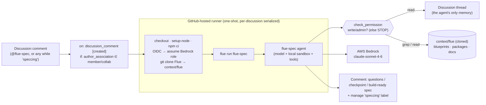

# spec-github-actions — async spec-interview agent on GitHub Discussions

> One of the [Flue Agent Reference Architectures](../../README.md). See
> [AGENTS.md](../../AGENTS.md) for the shared patterns and
> [docs/adding-skills.md](../../docs/adding-skills.md) for adding your own skills.

The **middle stage** of an ideate → spec → implement pipeline. An approved idea
lives as a GitHub **Discussion**; a permission-holding maintainer **@-mentions
the agent** (`@flue-spec`) in it to kick off an **async, spec-driven interview**.
The agent grills the humans one design-branch at a time — recommending an answer
for each decision, grounded in Flue's own source — and, at **human-confirmed
convergence**, posts a **build-ready spec**. It never triggers the next stage; a
human does.

It is the discussion-native sibling of the one-shot Actions examples: same
`flue run`/OIDC→Bedrock shape, but the trigger is a **discussion comment** and
the agent runs an **iterative conversation** rather than a single pass.

## Why a comment trigger, and why cold-start

A GitHub-hosted runner is a one-shot executor — there is no always-on server, so
no Flue channel. Instead **GitHub Actions is the trigger**: `on:
discussion_comment [created]` runs `flue run` once and exits. Each wake is
**cold**, so the discussion thread is the agent's **only memory** — it re-reads
the whole thread every time and reasons from it (which decisions are made, what
the latest human asked).

```
Human @-mentions @flue-spec on a Discussion  (or comments while `speccing`)
  → on: discussion_comment [created]  (if: author is a repo member/collaborator)
  → runner: npm ci → clone Flue → flue run flue-spec
  → agent: check permission (write/admin) → read thread → ground in Flue source
  → posts the next batch of questions / a convergence checkpoint / the final spec
  → exits (the human replies later, waking it again)
```



## The interview

The methodology is adapted from the "grilling" discipline (walk a design tree one
branch at a time, recommend an answer, converge) — made **async**: humans reply
over hours, and the agent **batches tightly-related decisions** per comment to
limit cold-start round-trips. The recurring forks for a Flue example (trigger→
deploy, channel vs tool, which `@flue/*`, sandbox, skill, tests) live in the
skill's `references/design-tree.md`; the final output shape is
`references/spec-template.md`.

- **Kickoff** requires an explicit `@flue-spec` mention (a deliberate human act —
  no ideate→spec auto-chain). The agent adds a **`speccing`** label.
- While **`speccing`** is present, the agent responds to any permission-holder's
  comment (no mention needed) — the interview flows.
- **Convergence is human-confirmed:** the agent posts a decisions checkpoint and
  waits; a human replies `finalize` (or force-finalizes anytime) → the agent
  posts the final spec and **removes `speccing`**.

## Authorization (the comment trigger is world-writable)

Two layers, because anyone can comment on a public repo:

1. **Cheap `if:` filter** — the workflow only starts for
   `author_association ∈ {OWNER, MEMBER, COLLABORATOR}` and non-bot senders, so
   drive-by comments never launch a runner.
2. **Authoritative check** — the agent's first step is `github_check_permission`
   (the collaborator-permission REST endpoint); it requires `write`/`admin`
   before any model work. If it fails, the agent stops silently.

## What it reads and writes

- **Reads (no token):** its standing memory
  [`references/preferences.md`](.agents/skills/flue-spec/references/preferences.md)
  (hard rules it must obey — e.g. "infra → AWS, never Cloudflare") **first**, then
  Flue's repo cloned into `context/flue` (blueprints, `packages/` source,
  `apps/docs`) — `grep`/`read`, the grounding for a build-ready spec.
- **Reads/writes (typed tools, GraphQL — Discussions have no REST API):**
  `github_list_discussion` (the thread + replies = memory),
  `github_add_discussion_comment` (questions/checkpoint/spec),
  `github_add_discussion_label` / `github_remove_discussion_label` (manage
  `speccing`), `github_check_permission` (REST — the authorization gate), and
  `github_open_learning_issue` (propose a durable memory rule).
- **Fast feedback (workflow-level, not a tool):** the workflow reacts on the
  triggering comment — **👀** as its first step (before checkout, so within a
  second or two), **🚀** on success, **😕** on failure. This is deterministic and
  covers early failures the agent never reaches.

## Standing memory & self-learning (human-gated)

The agent reads [`references/preferences.md`](.agents/skills/flue-spec/references/preferences.md)
every run and treats each rule as a **hard constraint**. It ships with neutral
defaults + "edit for your org"; this repo's copy carries real rules (AWS-only
infra, etc.).

Memory **grows** without breaking the human-gated pipeline: when a human states a
**durable rule** in a discussion, the agent opens a **`spec-learning`** issue (the
rule + the complete proposed `preferences.md`). A maintainer applies
**`approved-learning`** → [`learning-apply.yml`](.github/workflows/learning-apply.yml)
— a **deterministic, model-free** workflow, the only one with `contents`/
`pull-requests: write` — opens a PR editing `preferences.md`; a human merges it.
The comment-triggered interview job stays read-only, so PR-write never lives on
the world-writable path (prompt-injection safety).

## Promotion to an issue (separate, model-free)

When a maintainer applies the **`approved`** label to a discussion,
[`promote.yml`](.github/workflows/promote.yml) — a **deterministic, token-only**
workflow (no Bedrock, no model) — creates an Issue seeded with the latest spec
comment, labelled `approved-spec`, and cross-links the two. The issue is **inert**
(a human review checkpoint); a human later applies `implement` to hand it to the
future build agent. No agent auto-triggers the next stage.

## Shape

```
AGENTS.md                                   # agent framing
.agents/skills/flue-spec/
├── SKILL.md                                # the async interview procedure
└── references/
    ├── design-tree.md                      # the recurring forks for a Flue example
    ├── spec-template.md                    # the build-ready spec output shape
    └── preferences.md                      # standing memory — hard rules (self-learning)
.github/workflows/
├── spec.yml                                # comment-triggered interview (Bedrock+OIDC, gated)
├── promote.yml                             # approved → issue (deterministic, token-only)
└── learning-apply.yml                      # approved-learning → PR editing preferences.md
src/
├── agents/flue-spec.ts                     # model + local() sandbox + tools — NO channel
└── tools/github/
    ├── github.ts                           # discussion tools (GraphQL) + permission (REST)
    ├── helpers.ts                          # pure: reducer, mention/permission logic
    └── helpers.test.ts                     # unit tests (node:test, no extra deps)
context/flue/                               # Flue cloned at runtime (gitignored)
```

## Run it locally

```bash
npm install
cp .env.example .env   # Bedrock via AWS_PROFILE; GITHUB_TOKEN (PAT, repo scope)
# Clone Flue so the agent has live source on disk (CI does this for you):
git clone --depth 1 --filter=blob:none https://github.com/withastro/flue.git context/flue
./node_modules/.bin/flue run flue-spec \
  --input '{"message":"Spec discussion your-org/your-repo#42; triggered by @you."}'
```

The skill parses the `owner/repo`, discussion number, and triggering login out of
the `message`, checks permission, reads the thread, and posts the next interview
step.

### Tests

```bash
npm test
```

The pure helpers — the cold-start ask/wait/converge reducer, mention detection
(kickoff gate), and the write/admin authorization check — have `node:test` unit
tests (no extra deps). The repo-root `ci.yml` also runs `tsc` and the Flue build.

## Deploy

1. **Bedrock via OIDC** (no long-lived keys): create the GitHub OIDC provider +
   a Bedrock-only IAM role, and set repository variables `AWS_ROLE_ARN`,
   `AWS_REGION`. See
   [docs/github-actions-bedrock-oidc.md](../../docs/github-actions-bedrock-oidc.md).
2. **Enable Discussions** and create the labels: `speccing`, `approved`,
   `approved-spec`, `spec-learning`, `approved-learning` (Issues → Labels; they
   apply to discussions too).
3. Commit the workflows. Mentioning `@flue-spec` on a discussion then starts an
   interview; applying `approved` promotes the result to an issue.
4. *(Optional)* set `SKILLS_REPO` to load the skill from its own repo on a
   separate release cycle.

## Trigger drives deploy

Comment trigger → one-shot runner is the CI-driven path. For an always-on server
that reacts to discussion events in real time, use Flue's official GitHub channel
(`@flue/github`) on a long-running deploy instead. Same agent, different ingress.
See [AGENTS.md](../../AGENTS.md).
