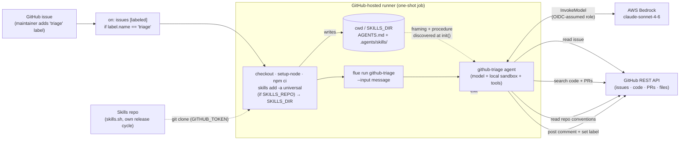

# triage-github-actions — GitHub issue triage, one-shot on GitHub Actions

> One of the [Flue Agent Reference Architectures](../../README.md). See
> [AGENTS.md](../../AGENTS.md) for the shared patterns and
> [docs/adding-skills.md](../../docs/adding-skills.md) for adding your own skills.

GitHub is the **work source, the code host, and the deploy** all at once. A
maintainer applies the **`triage` label** to an issue; the `labeled` event runs
the agent **one-shot on a GitHub-hosted runner** (`flue run`), which reads the
issue, enriches it with related code, pull requests, and the repo's own
conventions, then posts a triage comment and sets a category label back.

This is the GitHub-native counterpart to
[`triage-jira-gitlab-runner`](../triage-jira-gitlab-runner/): a CI event → a
one-shot runner, no long-running server.

## Why no channel — and how a label reaches a runner

Flue ships an official GitHub **channel** (`@flue/github`'s
`createGitHubChannel`) for the webhook→server path — that's the GitHub analog of
[`triage-jira-k8s`](../triage-jira-k8s/), and it's the right tool when you want
an always-on listener (e.g. replying to `issue_comment` events in real time).

This example deliberately takes the **other** path. A GitHub-hosted runner is a
one-shot CI executor with no always-on listener, so there is no Flue channel
here. Instead, **GitHub Actions itself is the trigger**: the `triage` label fires
an `on: issues [labeled]` workflow, gated to that one label, and `flue run` is
the entry point.

```
Maintainer adds the `triage` label to an issue
  → on: issues [labeled]  (job gated to label.name == 'triage')
  → GitHub-hosted runner: npm ci → flue run github-triage --input '{"message":…}'
  → agent reads the issue, searches code + PRs, posts a comment, sets a label → exits
```

The repo slug and issue number arrive as workflow context (passed safely via
`env:`, never interpolated into the shell); the skill parses `owner/repo#number`
out of the `message`. No webhook server, no load balancer, no Kubernetes.



```yaml
# .github/workflows/triage.yml (ships in this folder) — the gated trigger + run
on:
  issues:
    types: [labeled]
jobs:
  triage:
    if: github.event.label.name == 'triage'
    runs-on: ubuntu-latest
    timeout-minutes: 30
    permissions:
      id-token: write # mint the OIDC token to assume the Bedrock role
      contents: read # read repo files for enrichment
      issues: write # post the triage comment and set labels
    steps:
      - uses: actions/checkout@v4
      - uses: actions/setup-node@v4
        with: { node-version: 22 }
      - run: npm ci
      - name: Configure AWS credentials (OIDC) # short-lived, no stored keys
        uses: aws-actions/configure-aws-credentials@v4
        with:
          role-to-assume: ${{ vars.AWS_ROLE_ARN }}
          aws-region: ${{ vars.AWS_REGION }}
      - name: Run triage agent
        env:
          # AWS_* are already in the env from the OIDC step above.
          GITHUB_TOKEN: ${{ secrets.GITHUB_TOKEN }}
          REPO: ${{ github.repository }}
          ISSUE_NUMBER: ${{ github.event.issue.number }}
        run: |
          ./node_modules/.bin/flue run github-triage \
            --input "$(printf '{"message":"Triage GitHub issue %s#%s."}' "$REPO" "$ISSUE_NUMBER")"
```

## Shape

```
AGENTS.md                                  # agent framing
.agents/skills/github-triage/SKILL.md       # the triage procedure
.github/workflows/triage.yml                # the gated workflow that runs `flue run`
src/
├── agents/github-triage.ts                # model + local() sandbox + tools — NO channel
└── tools/github/github.ts                 # outbound GitHub tools (@octokit/rest)
```

GitHub is both work source and code host, so a single `src/tools/github/`
module covers reading the issue, searching code/PRs, reading files, and writing
the comment + label back. There is no `src/channels/` (the workflow is the
trigger) and no `k8s/` (the runner is the deploy).

## Run it locally (one-shot, exactly as CI does)

```bash
npm install
cp .env.example .env   # Bedrock uses AWS_PROFILE (no key); add a GITHUB_TOKEN (PAT, repo scope)
./node_modules/.bin/flue run github-triage \
  --input '{"message":"Triage GitHub issue your-org/your-repo#42."}'
```

`flue run` input must be an object with a string `message`; the skill parses the
`owner/repo` and issue number out of it, reads the issue, searches the repo,
applies the repo's conventions, and posts a comment back.

## Deploy

1. Wire up Bedrock auth via **GitHub OIDC** — no long-lived AWS keys:
   - In AWS, create (once) the GitHub OIDC identity provider
     (`token.actions.githubusercontent.com`) and an IAM role whose trust policy
     allows this repo's OIDC subject. Scope the role to `bedrock:InvokeModel` on
     the `us.` inference profile only (see the repo AGENTS.md Bedrock gotcha).
   - Add the role ARN and region as repository **variables** (Settings → Secrets
     and variables → Actions → Variables): `AWS_ROLE_ARN`, `AWS_REGION`. There is
     no model secret to store. `GITHUB_TOKEN` is provided automatically — the
     workflow's `permissions:` block scopes it (`id-token: write` for OIDC,
     `contents: read`, `issues: write`). Full CLI setup (OIDC provider, role,
     trust policy, `gh` variables) with copy-paste placeholders:
     [docs/github-actions-bedrock-oidc.md](../../docs/github-actions-bedrock-oidc.md).
2. Create a label named `triage` in the repo (Issues → Labels).
3. Commit `.github/workflows/triage.yml`. From then on, applying the `triage`
   label to any issue runs the agent once.

To read code in **other** repos beyond the one the workflow runs in, the
built-in `GITHUB_TOKEN` is not enough (it is scoped to the current repo) — use a
PAT or a GitHub App token with access to those repos, stored as a secret, and
reference it in the workflow's `GITHUB_TOKEN` env instead.

### Skills in production

The skill committed in this repo's `.agents/skills/` is the default. To run the
skills from their own repo on a **separate release cycle** (without changing this
agent), set the optional repository variable `SKILLS_REPO` (the repo path,
`owner/repo`). The workflow installs it with `skills add -a universal` — which
lands straight in `.agents/skills/` — and exports `SKILLS_DIR`; Flue discovers
`$SKILLS_DIR/.agents/skills/` at init. No rebuild — the next run picks it up. A
private skills repo is cloned with the built-in `GITHUB_TOKEN` via a one-line
`git config … insteadOf` rewrite. See
[docs/adding-skills.md](../../docs/adding-skills.md).

This is the GitHub-Actions counterpart to `triage-jira-gitlab-runner`'s
`before_script` fetch — same `SKILLS_DIR` contract, same skills.sh delivery, just
a GitHub workflow step instead of a GitLab `before_script`.

## Trigger drives deploy

This pairing — `triage` label → `on: issues [labeled]` → one-shot runner — is the
CI-driven path. For an always-on server that reacts to issue/PR comments in real
time, use Flue's official GitHub channel (`@flue/github`) on a long-running
deploy instead (the GitHub analog of `triage-jira-k8s`). Same agent, different
ingress. See [AGENTS.md](../../AGENTS.md).
