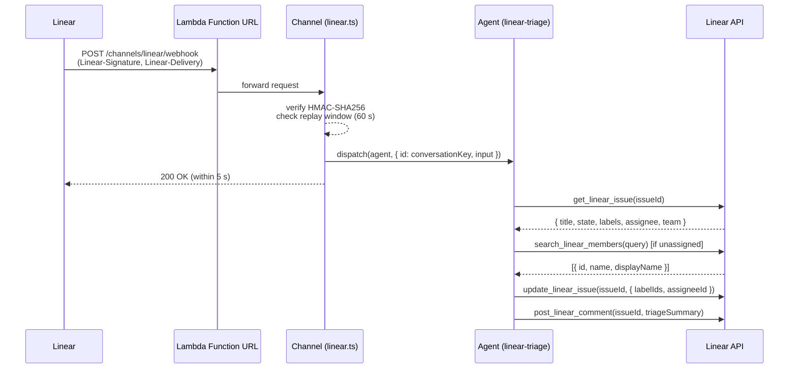

# triage-linear-lambda — Linear Triage Agent on AWS Lambda

> One of the [Flue Agent Reference Architectures](../../README.md). See
> [AGENTS.md](../../AGENTS.md) for the shared patterns.

A [Flue](https://flueframework.com) agent that receives a Linear issue-comment
webhook, reads the full issue, applies label and assignee suggestions, and posts
a structured triage reply back onto the issue. Deployed as an **AWS Lambda
container image** exposed via a **Lambda Function URL**.



## Structure

```
.agents/
└── skills/
    └── linear-triage/
        ├── SKILL.md                    # triage procedure (discovered at runtime)
        └── references/
            └── triage-checklist.md     # quality checklist read by the skill
AGENTS.md                               # always-on agent framing
src/
├── agents/
│   └── linear-triage.ts               # pure wiring: model, sandbox, tools
├── channels/
│   └── linear.ts                      # inbound: HMAC verify → dispatch by issue id
└── tools/
    └── linear/
        ├── linear.ts                  # 4 outbound tools (get, comment, update, search)
        └── helpers.ts                 # pure helpers (unit tested, no SDK dep)
test/
├── channels/
│   └── linear.test.ts                 # HMAC/routing integration tests
└── tools/
    └── linear/
        └── helpers.test.ts            # pure-logic unit tests
Dockerfile                             # multi-stage: build → runtime (Node 22-slim)
.github/workflows/
└── deploy-triage-linear-lambda.yml   # OIDC → ECR → lambda update-function-code
```

### Where the text lives

There is no instruction prose in `src/`. The agent file is pure wiring; all text
is discovered by Flue from the workspace at `init()`:

- **`AGENTS.md`** — the agent's always-on framing.
- **`.agents/skills/linear-triage/SKILL.md`** — the six-step triage procedure.

### Skills are discovered natively, not bundled

Flue discovers skills at `init()` from `<cwd>/.agents/skills/<name>/SKILL.md`
inside the agent's sandbox — no `import`, no `instructions` field. Edits land
without a rebuild:

```ts
const cwd = process.env.SKILLS_DIR ?? process.cwd();
export default defineAgent(() => ({
  sandbox: local({ cwd }),   // Flue reads AGENTS.md + skills from here
  // …
}));
```

## Deploy

### Prerequisites

1. An AWS account with an ECR repository named `triage-linear` and a Lambda
   function named `triage-linear` (container image runtime, Node 22).
2. A Lambda execution role with `AmazonBedrockFullAccess` (or a scoped Bedrock
   policy) attached.
3. A GitHub Actions OIDC provider in your AWS account and an IAM role
   `AWS_DEPLOY_ROLE_ARN` that allows `ecr:*` + `lambda:UpdateFunctionCode` +
   `lambda:WaitFor*`.
4. Add `AWS_DEPLOY_ROLE_ARN` as a GitHub Actions secret on this repo.

### Lambda Function URL

Create the Function URL once (after the function exists):

```bash
aws lambda create-function-url-config \
  --function-name triage-linear \
  --auth-type NONE \
  --region us-west-2
```

Register the returned URL as the Linear webhook endpoint.

**Auth trade-off:** `AuthType: NONE` means anyone with the URL can POST to it.
The channel's HMAC-SHA256 verification (`LINEAR_WEBHOOK_SECRET`) is the auth
layer. If you prefer URL-level protection, set `AuthType: AWS_IAM` and run a
small signing proxy in front.

### Lambda environment variables

Set via `aws lambda update-function-configuration` or your IaC tool:

| Variable | Required | Notes |
|---|---|---|
| `LINEAR_WEBHOOK_SECRET` | ✅ | HMAC signing secret from Linear webhook settings |
| `LINEAR_API_KEY` | ✅ | Bot user's personal API key (`lin_api_…`) |
| `LINEAR_ORGANIZATION_ID` | optional | Pin to one org; mismatches → 403 |
| `LINEAR_WEBHOOK_ID` | optional | Pin to one webhook; mismatches → 403 |
| `AWS_REGION` | ✅ | Bedrock region, e.g. `us-west-2` |

Bedrock credentials come from the Lambda execution role — no `AWS_PROFILE` in
production.

### Deploy flow (GitHub Actions)

Push to `main` with changes under `examples/triage-linear-lambda/` and the
workflow runs automatically:

1. `npm ci --ignore-scripts` + `tsc --noEmit` + `flue build --target node`
2. `docker build` → `docker push` to ECR
3. `aws lambda update-function-code --image-uri …`

## Local development

```bash
cp .env.example .env
# fill in LINEAR_API_KEY, LINEAR_WEBHOOK_SECRET, AWS_PROFILE, AWS_REGION
npm install
npm run dev     # starts flue dev server on :3000
```

Send a synthetic webhook:

```bash
# Sign a test payload
SECRET="your-local-webhook-secret"
BODY='{"type":"Comment","action":"create","organizationId":"org-1","webhookId":"wh-1","webhookTimestamp":'$(date +%s%3N)',"actor":{"id":"u1","name":"Test"},"data":{"id":"c1","body":"triage this","issueId":"ISSUE-ID"}}'
SIG=$(echo -n "$BODY" | openssl dgst -sha256 -hmac "$SECRET" -hex | awk '{print $2}')
curl -X POST http://localhost:3000/channels/linear/webhook \
  -H "content-type: application/json" \
  -H "linear-signature: $SIG" \
  -H "linear-delivery: 00000000-0000-4000-8000-000000000001" \
  -d "$BODY"
```

## Testing

```bash
npm test    # node --test, no extra deps
```

Covers:
- `test/tools/linear/helpers.test.ts` — `pickBestLabel` and `formatTriageSummary`
  pure-function unit tests.
- `test/channels/linear.test.ts` — HMAC verification, replay-window enforcement,
  Comment/create routing, and `conversationKey` round-trip.

## Open questions / production notes

**Agent-session upgrade path.** To handle Linear's AI agent sessions (where a
bot is mentioned in a comment and Linear streams tool calls back), replace
`LINEAR_API_KEY` with `LINEAR_ACCESS_TOKEN`, create a Linear OAuth app actor
with `app:mentionable`, and add the `isAgentSessionEvent` branch back to
`src/channels/linear.ts`.

**Deduplication.** `@flue/linear` exposes the `deliveryId` (`Linear-Delivery`
header) but does not deduplicate internally. For production under concurrent
retries, claim the `deliveryId` in DynamoDB before calling `dispatch`.

**`@linear/sdk` version.** Pinned to `^86.0.0` (the blueprint minimum). Check
the Linear changelog before upgrading past your installed version — the SDK
follows the GraphQL schema version.
