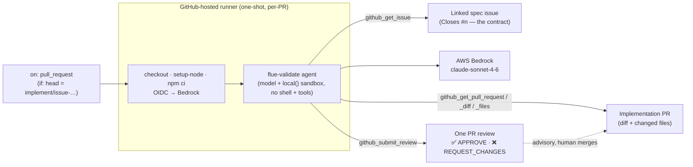

# validate-github-actions — review an implementation PR against its approved spec, on GitHub Actions

> One of the [Flue Agent Reference Architectures](../../README.md). See
> [AGENTS.md](../../AGENTS.md) for the shared patterns and
> [docs/adding-skills.md](../../docs/adding-skills.md) for adding your own skills.

The **review gate** of an ideate → spec → implement → **validate** pipeline. When
the implement agent opens a pull request, this agent reads the **PR diff** and the
**linked approved-spec issue** and submits **one review**: APPROVE if the build
matches the spec, **REQUEST_CHANGES** with an itemized list if it doesn't. It
answers the question CI can't — *does this code build the thing we agreed to
build?* — while CI's own `test` job answers *does it compile and pass?*

The review is **advisory**: a `github-actions[bot]` review does not satisfy
required human approvals, so a human still merges. The validator just gives the
human (and the implement agent, on the next push) a clear spec-match signal and a
concrete list to act on.

It is **read-only except for that single review** — it never checks out or runs
the PR's code, never edits files, never merges. Like the spec/ideate agents (and
unlike implement), the model gets **no shell**: it judges through typed Octokit
tools only.

## Flow

```
implement agent opens PR (Closes #<spec-issue>)
  → on: pull_request [opened, synchronize, reopened]
      (if: head branch starts with implement/issue-)
  → runner: checkout · setup-node · npm ci · OIDC → Bedrock
  → flue run flue-validate
  → agent: read PR + diff + changed files
          → read the linked spec issue (its body = the contract)
          → judge the four pieces, the wiring, the test plan, the wiring-in
          → submit ONE review: APPROVE / REQUEST_CHANGES (/ COMMENT if uncertain)
          → exits
  → human reads the review and merges
```



## What it checks

The spec issue body is the contract; the diff is the evidence. Working through
[`references/spec-match-checklist.md`](.agents/skills/flue-validate/references/spec-match-checklist.md),
the agent confirms:

- **The four pieces** — agent (pure wiring), channel/tools, skill (+ references),
  deploy — exist and match what the spec describes.
- **The wiring matches the spec's specific choices** — the exact `@flue/*`
  packages, the trigger, the deploy target, the model, and any decision the spec
  called out (FIFO vs standard queue, Daytona vs local, AWS vs Cloudflare…). A
  build that has all the files but wires the *wrong* queue type does not match.
- **The test plan is covered** and the example is **wired into the repo**
  (`.github/ci-examples.json` entry + README row).
- **It is safe and scoped** — only `.example` placeholders, no secrets, and the
  diff touches only the new example + the expected wiring edits.

It judges **substance over form**: a deviation the PR explains (e.g. the spec
cited an export the Flue source has since renamed) is a match — noted; a *silent*
departure from a spec decision is changes-requested; a point the spec is silent
on is not a discrepancy.

## The verdict, and the self-review quirk

The agent submits one review via `github_submit_review`:

- **matches** → `APPROVE` · **changes-requested** → `REQUEST_CHANGES` (numbered
  `spec says X → PR does Y`) · **uncertain** → `COMMENT` (only when the PR links
  no spec or the diff is unreadable — never a silent pass).

GitHub **forbids APPROVE/REQUEST_CHANGES on your own PR** (HTTP 422). Because the
implement agent's PRs are authored by `github-actions[bot]` and this validator is
the *same* bot, the strong review events would fail. The tool handles this: it
attempts the strong event, and on a 422 **downgrades to a plain `COMMENT`
review** — the verdict is always stated at the top of the review body, so the
signal survives the downgrade. (Run the validator under a *different* identity —
e.g. a GitHub App or a PAT for a bot account — and the APPROVE/REQUEST_CHANGES
review lands as a formal state.)

## Why auto, not label-gated

Unlike `implement` (and a future e2e stage), validation is **not** human-gated: it
runs on every implement PR open/update. It's cheap and read-only — it spends
tokens but creates no live state and takes no irreversible action, so there's no
reason to gate it behind a human. The single review it posts is advisory, and the
`implement/issue-` branch filter keeps it off unrelated PRs.

## Shape

```
AGENTS.md                                     # agent framing
.agents/skills/flue-validate/
├── SKILL.md                                  # the spec-match procedure
└── references/spec-match-checklist.md        # what "matches" means
.github/workflows/validate.yml                # on: pull_request → flue run
src/
├── agents/flue-validate.ts                   # model + local() (no shell) — NO channel
└── tools/github/
    ├── github.ts                             # get PR · diff · files · issue · submit review
    ├── helpers.ts                            # pure: repo parse, Closes-#n, verdict→event
    └── helpers.test.ts                       # unit tests (node:test, no extra deps)
```

## Run it locally

```bash
npm install
cp .env.example .env   # Bedrock via AWS_PROFILE/region; GITHUB_TOKEN (PAT, repo scope)
./node_modules/.bin/flue run flue-validate \
  --input '{"message":"Validate implementation PR your-org/your-repo#59 against its approved spec."}'
```

The skill parses the `owner/repo` and PR number, finds the spec issue the PR
closes, reads the diff, and submits the review.

### Tests

```bash
npm test
```

The pure helpers — repo parsing, extracting the `Closes #<n>` spec issue from the
PR body, and the verdict→review-event mapping — have `node:test` unit tests (no
extra deps). The repo-root `ci.yml` also runs `tsc` and the Flue build.

## Deploy

1. **Bedrock via OIDC** — set repository variables `AWS_ROLE_ARN`, `AWS_REGION`.
   See [docs/github-actions-bedrock-oidc.md](../../docs/github-actions-bedrock-oidc.md).
2. Commit the workflow. It then reviews every implement PR automatically. (No
   label to create — validation is not human-gated.)
3. *(Optional)* To get a formal APPROVE/REQUEST_CHANGES state instead of a
   COMMENT, run the agent under a non-bot identity (GitHub App / PAT) so it isn't
   reviewing its own PR.

## Trigger drives deploy

`pull_request` event → one-shot runner is the CI-driven path, the same shape as
the other GitHub Actions examples. See [AGENTS.md](../../AGENTS.md).
